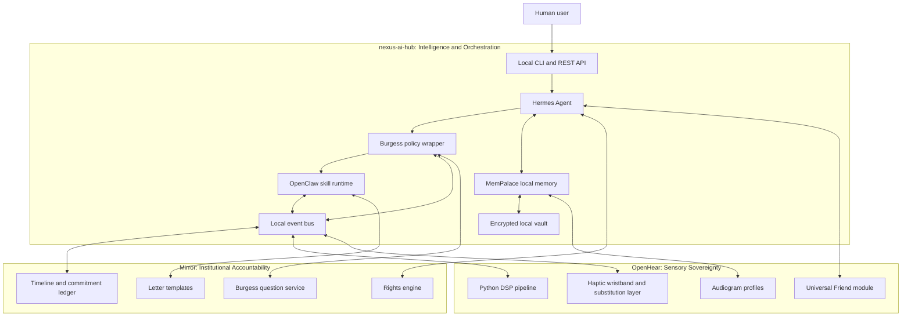

<div align="center">

# nexus-ai-hub

## Ecosystem Stack v3

**Central intelligence and orchestration for Mirror, OpenHear, and the Burgess Principle sovereign AI ecosystem**

[](https://github.com/ljbudgie/nexus-ai-hub/actions/workflows/ci.yml)
[](LICENSE)
[](https://www.python.org/downloads/)

</div>

---

## 1. Technical Ecosystem Identity

**nexus-ai-hub** is the central orchestration and intelligence layer for a sovereign,
local-first AI ecosystem. Its role is not to replace the domain pillars; it coordinates
agents, memory, skills, interfaces, and policy gates so each pillar can remain focused on
its own high-trust problem space while sharing a common technical substrate.

At the ecosystem level, the three pillars map as follows:

| Pillar | Primary responsibility | Technical role of nexus-ai-hub |
|--------|------------------------|--------------------------------|
| **Mirror** | Institutional accountability: rights mapping, Burgess Principle question engine, letter templates, commitment hashing, timelines, and domain-specific rights logic. | Provides agent execution, memory recall, skill wrapping, cross-case context, local API contracts, and audit-friendly event capture for Mirror workflows. |
| **OpenHear** | Sensory sovereignty: Python DSP pipeline, audiogram handling, Universal Friend, haptic wristband architecture, somatosensory substitution, and multisensory augmentation. | Provides profile memory, skill orchestration, local vector recall, perceptual event schemas, and agent-assisted configuration for sensory and haptic systems. |
| **nexus-ai-hub** | Central intelligence: Hermes Agent, MemPalace, OpenClaw skill registry, Advocate Companion integration, and Burgess Principle enforcement. | Acts as the local runtime that binds agents, tools, memory, governance, and user interfaces into a coherent personal AI operating layer. |

The hub currently integrates five components through Git submodules and a typed Python
package:

- **Hermes Agent** for multi-turn reasoning, tool orchestration, provider abstraction,
  and self-improving agent behaviour.
- **MemPalace** for persistent, local, high-recall memory and context reconstruction.
- **Awesome OpenClaw Skills** for a large plugin catalogue that can be loaded into
  agent runtimes.
- **Advocate Companion** for offline advocacy workflows grounded in the Burgess
  Principle.
- **The Burgess Principle** for the SOVEREIGN/NULL test, human-review doctrine, and
  foundational documents used to constrain agent behaviour.

In v3, nexus-ai-hub becomes the technical junction where institutional data from Mirror,
perceptual data from OpenHear, and reasoning state from Hermes/MemPalace are unified under
one local-first governance model.

---

## 2. Core Technical Principles

### Local-first architecture constraints

The ecosystem must be usable without cloud dependency or central accounts. Networked
providers may be optional accelerators, but the baseline runtime must remain local.

Required constraints:

- **No mandatory account system** for core functionality.
- **No mandatory cloud storage** for memory, advocacy records, audiograms, haptic
  profiles, or rights timelines.
- **Offline-capable execution** for case review, skill invocation, profile lookup,
  timeline inspection, and sensory configuration.
- **Local persistence by default**, using filesystem-backed stores, browser-local stores,
  encrypted vaults, and local vector indexes.
- **User-controlled export and deletion** for all memory, institutional, and sensory
  records.
- **Graceful degradation** when model providers, cloud APIs, or networked services are
  unavailable.

### Burgess Principle enforcement layer

Every decision path that can affect a person must be wrapped with the Burgess Principle:

> Was a human able to personally review the specific facts of this case?

Technically, this becomes a policy layer applied to agents, skills, UIs, and API routes.
The layer should classify actions into at least two states:

- **SOVEREIGN**: the workflow preserves human review, context, dignity, and agency.
- **NULL**: the workflow attempts to automate, deny, obscure, or finalize a high-stakes
  decision without adequate human review.

Recommended enforcement pattern:

1. **Intent classification** before a skill or agent action executes.
2. **Case-specific context retrieval** from MemPalace and Mirror records.
3. **Burgess check** against the SOVEREIGN/NULL test and domain-specific rights logic.
4. **Human-review gate** for high-impact outputs such as letters, appeals, institutional
   decisions, accommodations, medical/sensory recommendations, or automated denials.
5. **Commitment capture** when institutions, agents, or users make promises or decisions.
6. **Audit event emission** to a local append-only log.

### Data sovereignty patterns

The ecosystem should treat data as locally owned, revocable, portable, and explainable.
Key patterns:

- **Commitment hashing**: hash institutional commitments, generated letters, decisions,
  and timeline events so later changes can be detected without exposing content.
- **Local memory schemas**: store memory as typed records with provenance, sensitivity,
  retention policy, and Burgess classification metadata.
- **Encrypted vaults**: use per-user local encryption for high-sensitivity records such as
  health history, audiograms, haptic calibration, institutional case files, and identity
  documents.
- **Selective disclosure**: export only the minimum data needed for a given letter,
  appeal, clinical conversation, or device calibration.
- **Deterministic audit trails**: maintain local append-only event logs for skill calls,
  agent decisions, Burgess checks, and user approvals.
- **Schema versioning**: version all memory, profile, and event schemas so Mirror,
  OpenHear, and nexus-ai-hub can evolve independently without silent data loss.

---

## 3. Current Technical Stack

### Component breakdown and version pinning strategy

nexus-ai-hub is both a Python package and a submodule-based integration repository.
The package provides minimal typed implementations under `src/nexus_ai_hub/`, while the
full upstream projects are pinned as Git submodules.

| Component | Repository path | Current role | Pinning strategy |
|-----------|-----------------|--------------|------------------|
| Hermes Agent | `hermes-agent/` | Full agent runtime for reasoning, tool orchestration, provider routing, and CLI workflows. | Git submodule pinned by the superproject commit. Update with `git submodule update --remote --merge hermes-agent` when intentionally advancing. |
| MemPalace | `mempalace/` | Full memory system, including local recall and MCP-facing memory tools. | Git submodule pinned by the superproject commit. Memory APIs should be consumed through stable providers or MCP contracts. |
| Awesome OpenClaw Skills | `awesome-openclaw-skills/` | Skill catalogue containing 5,400+ installable capabilities. | Git submodule pinned by the superproject commit. Individual skills should declare metadata, version, safety class, and Burgess wrapper status. |
| Advocate Companion | `advocate-companion/` | Offline advocacy UI aligned with the Burgess Principle. | Git submodule pinned by the superproject commit. UI integration should occur through local APIs and exported case bundles. |
| The Burgess Principle | `burgess-principle/` | Foundational doctrine, SOVEREIGN/NULL test, templates, and AI-model context. | Git submodule pinned by the superproject commit. The doctrine should be treated as policy input, not mutable runtime state. |
| Python package | `src/nexus_ai_hub/` | Lightweight local package exposing `HermesAgent`, `MemPalace`, and `SkillRegistry` primitives. | Versioned through `pyproject.toml`; currently Python 3.10+ with typed package metadata. |

The current development loop is intentionally simple:

```bash
pip install -e ".[dev]"
ruff check src/ tests/
mypy src/
pytest --cov=nexus_ai_hub --cov-report=term-missing
```

### Current integration points and data flows

Current integrations are pragmatic and file-/tool-oriented:

1. **Hermes Agent → MemPalace**
   - Hermes can use MemPalace as a memory provider.
   - Session transcripts can be mined into local memory at session end.
   - MemPalace can expose MCP tools such as search, mine, status, and wake-up context.

2. **Hermes Agent → OpenClaw Skills**
   - Skills can be installed from the OpenClaw catalogue into Hermes skill directories.
   - The skill registry pattern supports discovery, registration, and invocation by name.
   - Burgess-wrapped variants can shadow original skills where high-stakes review is
     required.

3. **Advocate Companion → Burgess Principle**
   - Advocate workflows apply the human-review question to letters, contract review,
     reasonable adjustment requests, and institutional responses.
   - Browser-local storage enables offline use and reduces data exposure.

4. **nexus Python package → local primitives**
   - `HermesAgent` currently models conversation state and a placeholder chat loop.
   - `MemPalace` currently models local key-value memories with tags and JSON
     import/export.
   - `SkillRegistry` currently models metadata, registration, lookup, and execution.

### Existing limitations

The current stack is a strong foundation, but cross-component communication is still
immature:

- **No single event bus** for agent actions, memory writes, skill calls, UI decisions,
  Burgess checks, and sensory events.
- **No shared schema registry** for institutional cases, sensory profiles, haptic
  calibration, commitments, and memory records.
- **No unified identity boundary** across browser-local Advocate Companion state,
  MemPalace records, Hermes sessions, and future OpenHear profiles.
- **No standardized skill safety manifest** requiring Burgess classification, data access
  declarations, offline capability, or side-effect descriptions.
- **No first-class Mirror/OpenHear adapters** in the hub package yet.
- **Limited state reconciliation** between submodule runtimes and the lightweight package.
- **Limited provenance tracking** for how agent outputs were derived from memories,
  templates, sensory profiles, and institutional records.

---

## 4. Proposed Ecosystem Architecture v3

### High-level architecture

v3 should formalize nexus-ai-hub as a local orchestration plane with four shared
substrates: policy, memory, skills, and events.



### Proposed integration interfaces

#### nexus-ai-hub ↔ Mirror

Mirror should expose local contracts that Hermes and skills can call without requiring a
cloud service.

Recommended interfaces:

- **Rights engine API**
  - Input: jurisdiction, institution type, domain, user constraints, case facts.
  - Output: applicable rights map, evidence requirements, risk level, suggested next
    actions, and relevant templates.
- **Shared Burgess question service**
  - Input: proposed action, case facts, actor, decision impact, available human review.
  - Output: SOVEREIGN/NULL classification, rationale, required human gate, and audit
    event.
- **Commitment ledger API**
  - Input: commitment text, actor, source document, timestamp, optional hash salt.
  - Output: commitment ID, content hash, provenance pointer, and timeline event.
- **Template rendering API**
  - Input: template ID, case bundle, selected facts, tone, and disclosure policy.
  - Output: draft letter, citations, omitted facts list, and human-review checklist.

Mirror data should flow into MemPalace as structured institutional memories, not opaque
chat summaries. A rights event, commitment, template draft, or institution response should
remain queryable by domain, actor, date, sensitivity, and Burgess classification.

#### nexus-ai-hub ↔ OpenHear

OpenHear should integrate through local profile, event, and skill contracts.

Recommended interfaces:

- **Audiogram profile adapter**
  - Stores audiogram thresholds, device settings, calibration notes, provenance, and
    consent metadata in the encrypted vault and MemPalace index.
- **Haptic profile adapter**
  - Stores wristband channel layout, actuator mappings, frequency-to-pattern mappings,
    intensity limits, comfort thresholds, and training history.
- **Universal Friend skill interface**
  - Exposes Universal Friend as a skill that Hermes can invoke for sensory assistance,
    translation of audio events into accessible descriptions, haptic cue suggestions,
    and user-specific augmentation strategies.
- **Perceptual event stream**
  - Publishes local events such as `audio.detected`, `speech.segmented`,
    `haptic.pattern.played`, `profile.calibrated`, and `fatigue.reported` to the hub
    event bus.

This allows perceptual data to improve assistance without becoming surveillance data.
Raw audio should remain ephemeral by default; derived events and user-approved summaries
can be stored with explicit retention metadata.

#### Shared memory schema evolution

MemPalace should evolve from generic memories into typed, provenance-rich records. A v2
schema should support at least these record families:

| Record family | Example records | Required metadata |
|---------------|-----------------|-------------------|
| `conversation` | Hermes turns, summaries, user preferences. | session ID, source, timestamp, sensitivity, retention. |
| `institutional` | Mirror cases, rights maps, letters, commitments, denials, review requests. | institution, actor, jurisdiction, Burgess status, hash, provenance. |
| `sensory` | Audiograms, listening environments, haptic mappings, fatigue reports. | modality, device, calibration version, consent, precision, retention. |
| `skill` | Skill executions, manifests, outputs, failures. | skill ID, version, safety class, inputs hash, side effects, policy decision. |
| `policy` | SOVEREIGN/NULL checks, human approvals, blocked actions. | policy version, rationale, approver, impact class, audit pointer. |

Each record should include:

- `schema_version`
- `record_type`
- `record_id`
- `subject_id` or local pseudonymous profile ID
- `created_at` and `updated_at`
- `source_component`
- `provenance`
- `sensitivity_class`
- `retention_policy`
- `burgess_status`
- `embedding_policy`
- `content_hash`

#### Skill wrapping strategy

OpenClaw skills should become Burgess-compliant through a common wrapper rather than
per-skill ad hoc logic.

Recommended wrapper lifecycle:

1. Load skill manifest.
2. Determine safety class: informational, assistive, institutional, sensory,
   financial/legal/medical adjacent, or external side-effecting.
3. Resolve required data scopes from the manifest.
4. Run pre-execution Burgess check for high-impact actions.
5. Inject only the minimum approved context.
6. Execute skill in a local sandbox where possible.
7. Emit result, provenance, and side-effect summary.
8. Require human confirmation before sending, filing, publishing, deleting, or changing
   external state.
9. Store audit event and optional memory summary.

A compliant skill manifest should declare:

- skill ID, version, description, and author
- offline capability
- required permissions and data scopes
- side effects
- safety class
- Burgess wrapper requirement
- supported input/output schemas
- deterministic test fixtures
- compatibility with Mirror and/or OpenHear adapters

### Proposed technical standards

- **API contracts**: define local JSON Schema or Pydantic models for memory records,
  Burgess checks, rights maps, haptic profiles, audiogram profiles, skill manifests, and
  audit events.
- **Event bus**: use a local append-only event log with typed topics and replay support.
  SQLite, DuckDB, or a filesystem-backed log can serve as the first implementation before
  introducing heavier brokers.
- **Local vector store strategy**: embed only user-approved text or derived summaries;
  keep raw sensitive data outside vector indexes unless explicitly consented. Support
  pluggable local indexes such as SQLite vector extensions, FAISS, or Chroma-compatible
  local stores.
- **Skill auto-discovery protocol**: scan known local directories and Python entry points
  for manifests; validate schema; classify safety; register only compatible versions;
  expose discovery through CLI, REST, and Hermes tools.
- **Adapter boundary**: Mirror and OpenHear should integrate through stable local APIs,
  not direct database coupling.
- **Policy versioning**: every SOVEREIGN/NULL result should include the Burgess policy
  version and the component that performed the check.
- **Evaluation harness**: maintain fixtures for rights scenarios, sensory profile
  scenarios, memory recall, skill safety, and offline operation.

---

## 5. Sensory & Perceptual Technical Layer

OpenHear introduces a new class of data and runtime behaviour: perceptual augmentation.
Unlike ordinary documents or chat memories, sensory records may be continuous,
physiological, contextual, and device-dependent. The hub must therefore separate raw
signals, derived features, calibration profiles, and user-approved memories.

### Technical roadmap for OpenHear integration

1. **Profile ingestion**
   - Import audiograms, hearing preferences, listening contexts, device settings, and
     haptic comfort limits into encrypted local storage.
   - Store derived summaries in MemPalace with explicit consent and retention policy.

2. **DSP event abstraction**
   - Convert OpenHear DSP outputs into typed local events rather than storing raw audio.
   - Examples: detected speech band, environmental alert, directionality cue, frequency
     range emphasis, masking risk, and fatigue signal.

3. **Haptic wristband mapping**
   - Represent haptic output as composable patterns with channels, intensity,
     repetition, duration, semantic label, and contraindications.
   - Map perceptual features to haptic cues through user-calibrated profiles.

4. **Universal Friend as a skill**
   - Treat Universal Friend as a high-trust assistive skill that can explain sensory
     contexts, suggest calibration changes, and translate environmental cues into the
     user’s preferred modality.
   - Require policy safeguards for any advice that becomes medical, legal,
     institutional, or safety-critical.

5. **Multisensory substitution expansion**
   - Extend the schema beyond hearing to include vibration, visual cues, tactile maps,
     proprioceptive prompts, environmental context, and future cross-modal interfaces.
   - Preserve patient-led innovation principles: the user remains the source of truth for
     comfort, usefulness, fatigue, and acceptable trade-offs.

### Proposed cross-modal perception data models

A minimal perceptual profile model should include:

```yaml
schema_version: "2.0"
record_type: sensory.profile
profile_id: local-profile-id
modalities:
  hearing:
    audiogram_ref: vault://audiograms/latest
    frequency_bands: [low, mid, high]
    sensitivity_notes: user-approved-summary
  haptic:
    device_ref: local-device-id
    channels: [left_wrist_inner, left_wrist_outer]
    intensity_bounds: { min: 0.1, max: 0.7 }
    comfort_constraints: [avoid_continuous_high_intensity]
perceptual_frequency_metadata:
  source: calibration-session
  band_mapping_version: v1
  confidence: user-confirmed
consent:
  store_derived_events: true
  store_raw_audio: false
retention_policy: user-controlled
burgess_status: SOVEREIGN
```

A haptic pattern memory should connect sensation, meaning, and outcome:

```yaml
schema_version: "2.0"
record_type: sensory.haptic_pattern
pattern_id: doorbell-high-frequency-alert-v1
input_feature: audio.frequency_band.high_transient
output_pattern:
  channels: [left_wrist_outer]
  rhythm: double_pulse
  duration_ms: 450
  intensity: 0.45
semantic_label: doorbell_or_high_transient_alert
user_feedback: useful_without_fatigue
linked_memories:
  - sensory.profile.local-profile-id
  - conversation.calibration-session-2026-05
```

This model supports biohacking and patient-led innovation without reducing the user to a
passive data subject. The user can tune thresholds, reject patterns, document fatigue,
and preserve successful adaptations as local knowledge.

### Real-time sensory augmentation with Hermes and MemPalace

Hermes and MemPalace can support real-time sensory augmentation if the runtime separates
fast-path signal processing from slower reasoning:

- **Fast path**: OpenHear DSP and haptic control loops run locally with bounded latency
  and no agent dependency.
- **Context path**: derived events are published to the local event bus and optionally
  summarized into memory.
- **Reasoning path**: Hermes reviews context, explains patterns, suggests adjustments,
  and invokes Universal Friend when the user asks for help.
- **Memory path**: MemPalace recalls prior calibration outcomes, fatigue reports,
  successful pattern mappings, and environment-specific preferences.
- **Policy path**: Burgess checks apply when sensory outputs influence institutional,
  medical, accessibility, or safety-related decisions.

The key rule: the agent may assist sensory autonomy, but it must not become an opaque
authority over the user’s perception.

---

## 6. Implementation Roadmap

### Short term: 1-3 months

- Define shared JSON Schema/Pydantic contracts for memory records, Burgess checks, skill
  manifests, rights events, audiogram profiles, and haptic profiles.
- Build a shared Burgess wrapper library for skills, agents, and local API endpoints.
- Introduce MemPalace schema v2 with typed record families for conversation,
  institutional, sensory, skill, and policy data.
- Add a local append-only event log for agent actions, skill calls, policy decisions,
  and memory writes.
- Create initial Mirror adapter contracts for rights checks, question service calls,
  commitment hashing, and template rendering.
- Create initial OpenHear adapter contracts for audiogram import, haptic profile storage,
  Universal Friend skill invocation, and derived perceptual events.
- Add skill manifest validation and safety classification to the registry path.
- Document local-first storage boundaries and default retention policies.

### Medium term: 6-18 months

- Implement deep Mirror integration with rights maps, timeline synchronization,
  commitment ledgers, and letter template generation.
- Implement deep OpenHear integration with DSP event ingestion, haptic calibration
  profiles, Universal Friend runtime support, and sensory memory recall.
- Provide a unified local CLI and REST API for agents, memory, skills, Mirror workflows,
  and OpenHear profiles.
- Add skill auto-discovery across nexus-ai-hub, Mirror, OpenHear, Advocate Companion,
  and OpenClaw-compatible directories.
- Add local vector search with sensitivity-aware embedding policies and per-record
  consent flags.
- Add encrypted vault support for institutional files, audiograms, haptic profiles, and
  high-sensitivity memories.
- Build replayable event streams for debugging, audit, and evaluation.
- Add integration tests for offline operation, SOVEREIGN/NULL enforcement, memory recall,
  and skill safety.

### Long term: 3+ years

- Build a full perceptual intelligence layer that learns user-approved mappings between
  environments, sensory features, haptic patterns, fatigue, and outcomes.
- Enable cross-project agent orchestration where Hermes can coordinate Mirror cases,
  OpenHear sensory sessions, and general skills under one policy plane.
- Establish an ecosystem-wide evaluation harness for rights accuracy, memory recall,
  sensory usability, privacy guarantees, and Burgess compliance.
- Support multi-device local sync using encrypted, user-controlled replication rather
  than cloud accounts.
- Mature Universal Friend into a modular assistive intelligence layer that remains
  inspectable, overrideable, and grounded in user-led calibration.
- Create standards for sovereign AI case bundles that can be exported, verified, and
  understood by humans without proprietary services.

---

## 7. Technical Differentiators & Trade-offs

### Differentiators

Compared with typical agent and memory hubs, nexus-ai-hub is differentiated by its
combination of local-first infrastructure, rights-aware policy, and sensory sovereignty.

| Dimension | Typical agent/memory hub | nexus-ai-hub Ecosystem Stack v3 |
|-----------|--------------------------|---------------------------------|
| Primary optimization | Tool use, automation, cloud sync, model access. | Human agency, local control, institutional accountability, perceptual autonomy. |
| Memory model | Conversation history, embeddings, summaries. | Typed local memory spanning conversations, rights cases, commitments, sensory profiles, haptic mappings, and policy events. |
| Policy layer | Optional safety filters or provider moderation. | Mandatory Burgess SOVEREIGN/NULL gate for high-impact decisions. |
| Skill model | Plugins optimized for capability breadth. | Skills wrapped with manifests, data scopes, safety classes, audit events, and human-review gates. |
| Sensory support | Usually absent or cloud/device specific. | OpenHear integration for audiograms, DSP events, haptic substitution, and Universal Friend. |
| Institutional workflows | Generic document assistance. | Mirror integration for rights mapping, templates, timelines, and commitment hashing. |
| Sovereignty stance | Account-centric and provider-mediated. | Offline-capable, exportable, locally encrypted, and user-governed. |

### Trade-offs

Local-first design is not free. The ecosystem accepts several trade-offs deliberately:

- **Operational complexity**: local storage, encryption, vector indexes, device adapters,
  and submodule pinning require more engineering discipline than a single hosted service.
- **Model variability**: offline and optional-provider modes may produce different output
  quality depending on available local models and hardware.
- **Sync constraints**: avoiding mandatory cloud accounts makes multi-device sync harder;
  encrypted user-controlled replication must replace centralized state.
- **Latency boundaries**: real-time OpenHear DSP and haptic feedback cannot depend on
  slower agent reasoning loops.
- **Schema governance**: shared records across Mirror, OpenHear, and nexus-ai-hub require
  versioning, migration tools, and compatibility tests.
- **Safety friction**: Burgess gates intentionally slow down high-impact automation when
  human review is required.

The ecosystem resolves these trade-offs by separating fast local loops from reasoning
loops, using typed schemas instead of opaque state, making cloud services optional, and
requiring human-review gates only where the impact justifies them.

---

## 8. North Star Technical Vision

The destination is a unified, sovereign, human-first AI operating system for personal
rights, sensory sovereignty, and intelligent agency.

In that operating system:

- Mirror gives the user institutional memory, rights context, timeline evidence,
  commitment verification, and letters that preserve human review.
- OpenHear gives the user perceptual agency through local DSP, audiogram-aware profiles,
  haptic substitution, Universal Friend, and future multisensory augmentation.
- nexus-ai-hub gives the user a central intelligence layer that can reason, remember,
  orchestrate skills, apply policy, and explain its actions without requiring cloud
  dependency or surrendering personal data.

The technical north star is not merely a better chatbot or a larger skill catalogue. It is
an inspectable local system where AI helps a person defend their rights, adapt their
sensory world, and act with more agency while the Burgess Principle remains enforced at
every layer:

**If a system affects a human life, the human must remain visible, reviewable, and
sovereign.**
